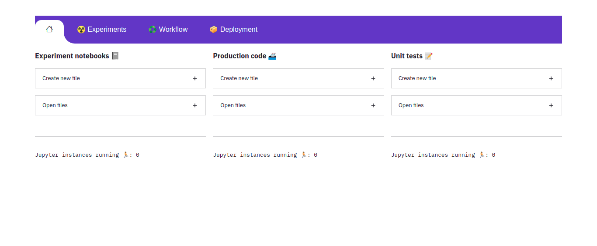

<div align="center">


   
**Automate data science tasks, not with 600 lines of code, but with a button**
   
**If it can be automated, assign it to a button**
 
<p align="center">
   <a href="https://github.com/bipinKrishnan/centroid/#why-automax-">Why Automax🤔</a> |
   <a href="https://github.com/bipinKrishnan/centroid/#quickstart">Quickstart🚀</a> |
   <a href="https://github.com/bipinKrishnan/centroid/#">Tutorials🧑‍🏫</a> |
   <a href="https://github.com/bipinKrishnan/centroid/#">Forums💬</a>
</p>

   [](https://github.com/bipinKrishnan/centroid/blob/main/LICENSE)
   [](https://github.com/bipinKrishnan/centroid/blob/main/LICENSE)
   [](https://github.com/bipinKrishnan/centroid/blob/main/LICENSE)
   [](https://github.com/bipinKrishnan/centroid/blob/main/LICENSE)
   [](https://github.com/bipinKrishnan/centroid/blob/main/LICENSE)
   
   
</div>

_________________________________________________________________________________________

## Why Automax🤔

With Automax, you can:

* Automate the process of creating a project structure.
* Do all these with the click of a button:

    ♻️ Running workflows
      
   📝 Running unit tests
      
   🕵️ See all the cell outputs of a notebook without opening it
      
   📓 Edit python files as if they were jupyter notebooks
   
   📊 Get complete profile for a dataset
   
   🗒️ Get baseline results from a set of models

## Usage
```bash
   python3 centroid <path_to_project> <project_name>
```



# TODO
1. Create a better intro at the bottom of the logo, that describes what centroid is and how one can benefit from using it
