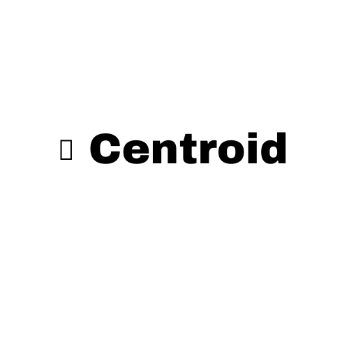
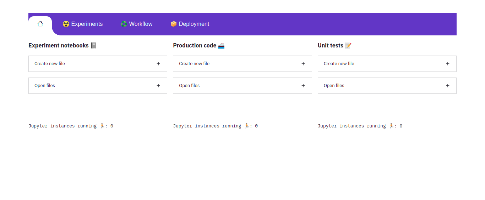

<div align="center">



**Central dashboard to control every aspect of your data science project during development**
   
**Starting from experimentation to unit tests 🏁**
   
   
<p align="center">
   <a href="https://github.com/bipinKrishnan/centroid/#Why Centroid">Why Centroid</a> |
   <a href="https://github.com/bipinKrishnan/centroid/#Quickstart">Quickstart</a> |
   <a href="https://github.com/bipinKrishnan/centroid/#">Tutorials</a> |
   <a href="https://github.com/bipinKrishnan/centroid/#">Forums</a>
</p>

_________________________________________________________________________________________
   [](https://github.com/bipinKrishnan/centroid/blob/main/LICENSE)
   [](https://github.com/bipinKrishnan/centroid/blob/main/LICENSE)
   [](https://github.com/bipinKrishnan/centroid/blob/main/LICENSE)
   [](https://github.com/bipinKrishnan/centroid/blob/main/LICENSE)
   [](https://github.com/bipinKrishnan/centroid/blob/main/LICENSE)
   
</div>

## Why Centroid ?



This dashboard will be your go to place for automating the repitive processes with the click of a button. There are things that data scientists always do when starting a project, no more of hand coding those tasks anymore because you have centroid in your toolkit now.

## Usage
```bash
   python3 centroid <path_to_project> <project_name>
```
